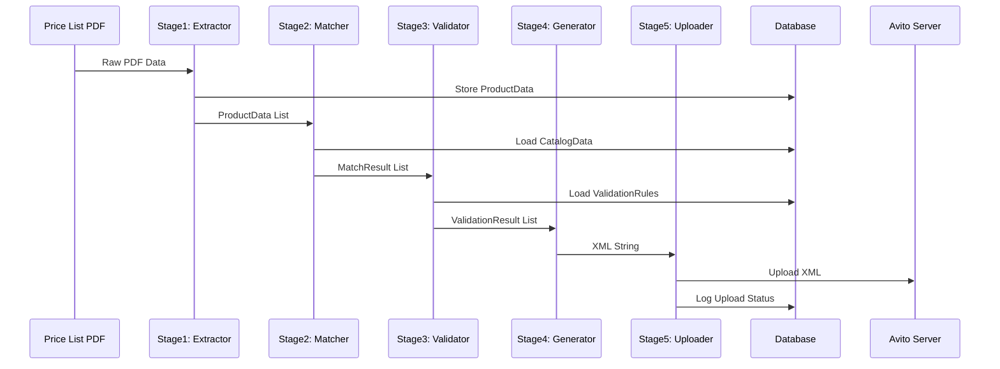
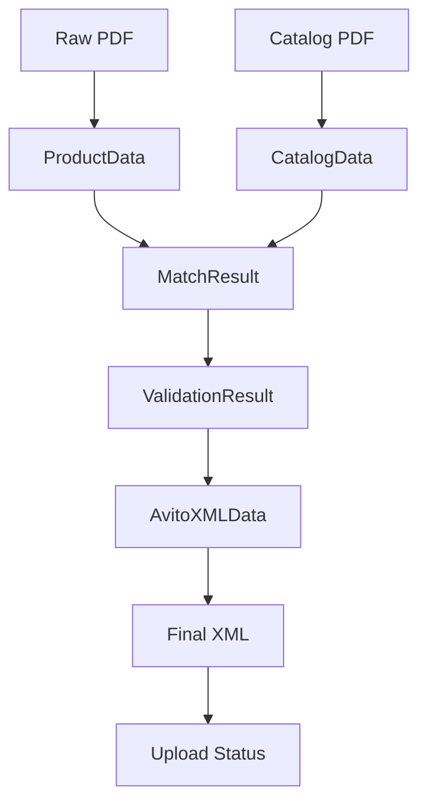
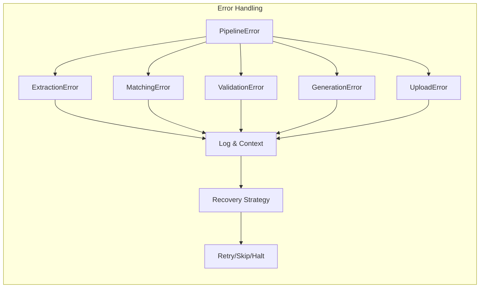

# 🏗️ Avito Pipeline Architecture Documentation

## Table of Contents
1. [System Architecture Overview](#system-architecture-overview)
2. [Data Flow Architecture](#data-flow-architecture)
3. [Module Structure](#module-structure)
4. [Stage-by-Stage Technical Details](#stage-by-stage-technical-details)
5. [Database Schema](#database-schema)
6. [Error Handling Strategy](#error-handling-strategy)
7. [Performance Optimization](#performance-optimization)
8. [Security Considerations](#security-considerations)

---

## System Architecture Overview

The Avito Snowmobile Pipeline follows a **5-stage modular architecture** with clean separation of concerns, enabling maintainable, testable, and scalable data processing.

### Core Design Principles

1. **Single Responsibility**: Each stage handles one specific aspect of processing
2. **Abstract Base Classes**: Common interface across all implementations
3. **Dependency Injection**: Configurable components with loose coupling
4. **Error Isolation**: Stage-specific error handling with detailed context
5. **Progressive Enhancement**: Graceful degradation when optional components fail

### Directory Structure

```
TEST_DUAL_PARSER_PIPELINE/
├── core/                           # Core data models and utilities
│   ├── __init__.py                 # Core module exports
│   ├── models.py                   # Data models (ProductData, ValidationResult, etc.)
│   ├── exceptions.py               # Custom exception hierarchy
│   └── database.py                 # Centralized database management
│
├── pipeline/                       # 5-stage pipeline architecture
│   ├── __init__.py                 # Pipeline module exports
│   ├── stage1_extraction/          # Data extraction stage
│   │   ├── __init__.py
│   │   ├── base_extractor.py       # Abstract extractor base class
│   │   ├── pdf_extractor.py        # PDF parsing implementation
│   │   └── llm_extractor.py        # LLM-powered extraction
│   ├── stage2_matching/            # Semantic matching stage
│   │   ├── __init__.py
│   │   ├── base_matcher.py         # Abstract matcher base class
│   │   ├── bert_matcher.py         # BERT semantic matching
│   │   └── claude_inheritance_matcher.py  # LLM inheritance matching
│   ├── stage3_validation/          # Data validation stage
│   │   ├── __init__.py
│   │   ├── base_validator.py       # Abstract validator base class
│   │   ├── internal_validator.py   # Internal business rules validator
│   │   └── brp_catalog_validator.py # External BRP catalog validator
│   ├── stage4_generation/          # XML generation stage
│   │   ├── __init__.py
│   │   ├── base_generator.py       # Abstract generator base class
│   │   └── avito_xml_generator.py  # Avito XML generation
│   └── stage5_upload/              # Upload and monitoring stage
│       ├── __init__.py
│       ├── base_uploader.py        # Abstract uploader base class
│       ├── ftp_uploader.py         # FTP upload implementation
│       └── processing_monitor.py   # Processing window monitoring
│
├── config/                         # Configuration management
│   ├── __init__.py
│   └── config.py                   # Pipeline configuration
│
├── tests/                          # Comprehensive test suite
│   ├── unit/                       # Unit tests for each component
│   ├── integration/                # End-to-end integration tests
│   └── performance/                # Performance and load tests
│
└── scripts/                        # Utility and deployment scripts
    ├── benchmark_pipeline.py       # Performance benchmarking
    └── health_check.py             # System health monitoring
```

---

## Data Flow Architecture

### High-Level Data Flow



### Data Models Flow



### Error Flow Architecture



---

## Module Structure

### Core Module (`core/`)

#### `models.py` - Data Model Definitions
```python
@dataclass
class ProductData:
    """Core product data structure with validation"""
    model_code: str          # 4-character BRP model code
    brand: str              # BRP, LYNX, SKI-DOO
    year: int               # Model year (2015-2030)
    malli: Optional[str]    # Finnish model name
    paketti: Optional[str]  # Package/trim specification
    # ... additional fields with type hints

@dataclass  
class ValidationResult:
    """Comprehensive validation result with detailed feedback"""
    success: bool
    errors: List[str]
    warnings: List[str]
    suggestions: List[str]
    confidence: float
    metadata: Dict[str, Any]
```

#### `exceptions.py` - Exception Hierarchy
```python
class PipelineError(Exception):
    """Base exception with stage context and metadata"""
    
class ExtractionError(PipelineError):
    """PDF extraction and parsing errors"""
    
class MatchingError(PipelineError):
    """BERT matching and similarity errors"""
    
class ValidationError(PipelineError):
    """Business rule and field validation errors"""
```

#### `database.py` - Database Management
```python
class DatabaseManager:
    """Centralized database operations with connection pooling"""
    
    def save_product_data(self, products: List[ProductData]) -> int
    def load_product_data(self, filters: Dict) -> List[ProductData]
    def save_validation_result(self, result: ValidationResult) -> bool
    def get_statistics(self) -> Dict[str, Any]
```

### Pipeline Stages

#### Stage 1: Data Extraction
```python
class BaseExtractor(ABC):
    """Abstract base class for all extractors"""
    
    @abstractmethod
    def extract(self, source: Path) -> List[ProductData]
    
    def validate_source(self, source: Path) -> bool
    def extract_with_hooks(self, source: Path) -> List[ProductData]
```

#### Stage 2: Matching Engine
```python
class BaseMatcher(ABC):
    """Abstract base class for semantic matching"""
    
    @abstractmethod
    def match_product(self, product: ProductData, 
                     catalog_entries: List[CatalogData]) -> MatchResult
    
    def match_products(self, products: List[ProductData]) -> List[MatchResult]
```

#### Stage 3: Validation System
```python
class BaseValidator(ABC):
    """Abstract base class for data validation"""
    
    @abstractmethod
    def validate_product(self, product: ProductData,
                        catalog_data: Optional[CatalogData]) -> ValidationResult
    
    def validate_products(self, products: List[ProductData]) -> List[ValidationResult]
```

---

## Stage-by-Stage Technical Details

### Stage 1: Data Extraction

#### PDF Processing Strategy
1. **Text Extraction**: PyMuPDF for text-based PDFs
2. **OCR Processing**: Tesseract for image-based content  
3. **Hybrid Processing**: Combined approach for mixed content
4. **Table Detection**: Intelligent table structure recognition

#### LLM Integration
```python
# Claude API integration with structured output
response = claude.messages.create(
    model="claude-3-sonnet-20241022",
    messages=[{
        "role": "user", 
        "content": f"Extract snowmobile data: {pdf_text}"
    }],
    system="Extract structured product data in JSON format..."
)
```

#### Field Normalization
- Model codes: 4-character alphanumeric (e.g., "TJTH", "FVTA")
- Finnish terms: Automatic translation and standardization
- Price parsing: Multi-currency support with validation
- Specification cleanup: Engine, track, starter normalization

### Stage 2: Matching Engine

#### BERT Semantic Matching
```python
# BERT embedding generation
from sentence_transformers import SentenceTransformer
model = SentenceTransformer('all-MiniLM-L6-v2')

# Semantic similarity calculation
embeddings = model.encode([product_text, catalog_text])
similarity = cosine_similarity(embeddings[0], embeddings[1])

# Domain-specific boosting
domain_boost = calculate_snowmobile_boost(product_text, catalog_text)
final_score = min(1.0, similarity + domain_boost)
```

#### Text Normalization Pipeline
1. **Trademark Removal**: Strip ®, ™, © symbols
2. **Abbreviation Expansion**: PKG → PACKAGE, E-TEC → ETEC
3. **Spacing Standardization**: Normalize whitespace and hyphens  
4. **Case Normalization**: Uppercase for consistency
5. **Pattern Matching**: Model family pattern recognition

#### Confidence Scoring
```python
def calculate_confidence(similarity_score: float, 
                        exact_matches: int,
                        domain_boost: float) -> float:
    """Multi-factor confidence calculation"""
    
    base_confidence = similarity_score
    exact_match_bonus = exact_matches * 0.1
    domain_bonus = min(domain_boost, 0.2)
    
    return min(1.0, base_confidence + exact_match_bonus + domain_bonus)
```

### Stage 3: Validation System

#### 4-Layer Validation Architecture

**Layer 1: Required Fields**
```python
REQUIRED_FIELDS = {
    'model_code': {'pattern': r'^[A-Z]{4}$', 'required': True},
    'brand': {'allowed': ['BRP', 'LYNX', 'SKI-DOO'], 'required': True},
    'year': {'min': 2015, 'max': 2030, 'required': True},
    'price': {'min': 100000, 'max': 10000000, 'currency': 'RUB'}
}
```

**Layer 2: Model Catalog (267 BRP Models)**
```python
BRP_MODEL_DATABASE = [
    "BRP Ski-Doo Summit X 850 E-TEC",
    "BRP Ski-Doo MXZ X 600R E-TEC",
    "BRP LYNX Adventure 600 EFI",
    # ... 264 additional models
]
```

**Layer 3: Field Rules (44 Validation Rules)**
```python
FIELD_VALIDATION_RULES = {
    'price': {'min': 100000, 'max': 10000000, 'precision': 0},
    'title': {'min_length': 10, 'max_length': 200, 'required_words': ['BRP']},
    'description': {'min_length': 50, 'max_length': 9000},
    # ... 41 additional rules
}
```

**Layer 4: Business Logic**
```python
BUSINESS_RULES = {
    'engine_compatibility': {
        'SUMMIT': ['600', '850'],
        'MXZ': ['600', '850'], 
        'EXPEDITION': ['900']
    },
    'brand_model_compatibility': {
        'SKI-DOO': ['SUMMIT', 'MXZ', 'RENEGADE'],
        'LYNX': ['ADVENTURE', 'RAVE', 'RANGER']
    }
}
```

### Stage 4: XML Generation

#### Template-Based Generation
```xml
<!-- Avito XML Template -->
<item>
    <id>{{ product.model_code }}_{{ product.year }}</id>
    <title>{{ product.generate_title() }}</title>
    <category>Мотоциклы и мототехника</category>
    <vehicle_type>Снегоходы</vehicle_type>
    <price>{{ product.price_rub }}</price>
    <description>{{ product.generate_description() }}</description>
    <!-- Additional fields -->
</item>
```

#### Field Mapping Strategy
```python
class AvitoFieldMapper:
    """Maps ProductData to Avito XML fields"""
    
    def map_price(self, product: ProductData) -> int:
        """Convert EUR to RUB with validation"""
        if product.currency == 'EUR':
            return int(product.price * 100)  # Approximate conversion
        return int(product.price)
    
    def map_title(self, product: ProductData) -> str:
        """Generate SEO-optimized title"""
        parts = [product.brand, product.malli, str(product.year)]
        return ' '.join(filter(None, parts))
```

### Stage 5: Upload Pipeline

#### FTP Upload with Retry Logic
```python
class FTPUploader:
    """Secure FTP upload with comprehensive error handling"""
    
    def upload_with_retry(self, content: str, filename: str, 
                         max_retries: int = 3) -> bool:
        for attempt in range(max_retries):
            try:
                return self._upload_attempt(content, filename)
            except FTPError as e:
                if attempt < max_retries - 1:
                    time.sleep(self.retry_delay * (2 ** attempt))
                    continue
                raise UploadError(f"Upload failed after {max_retries} attempts")
```

#### Processing Window Monitoring
```python
class ProcessingMonitor:
    """Avito processing window tracking"""
    
    PROCESSING_WINDOWS = ["03:00", "11:00", "19:00"]  # Moscow time
    
    def get_next_window(self) -> Dict[str, Any]:
        """Calculate time until next processing window"""
        current_hour = datetime.now().hour
        for window_time in self.PROCESSING_WINDOWS:
            hour = int(window_time.split(':')[0])
            if current_hour < hour:
                return {
                    'next_window': window_time,
                    'hours_remaining': hour - current_hour
                }
```

---

## Database Schema

### Core Tables

#### `price_entries` - Product Data Storage
```sql
CREATE TABLE price_entries (
    id TEXT PRIMARY KEY,                -- Composite: brand_modelcode_year
    price_list_id TEXT,                 -- Source price list reference
    model_code TEXT NOT NULL,           -- 4-character BRP model code
    malli TEXT,                         -- Finnish model name
    paketti TEXT,                       -- Package specification
    moottori TEXT,                      -- Engine specification
    telamatto TEXT,                     -- Track specification
    kaynnistin TEXT,                    -- Starter type
    mittaristo TEXT,                    -- Gauge specification
    kevatoptiot TEXT,                   -- Spring options
    vari TEXT,                          -- Color specification
    price REAL,                         -- Price value
    currency TEXT DEFAULT 'EUR',       -- Currency code
    market TEXT DEFAULT 'FINLAND',     -- Target market
    brand TEXT NOT NULL,                -- Manufacturer brand
    model_year INTEGER,                 -- Model year
    
    -- Processing metadata
    catalog_lookup_key TEXT,            -- Matching key for catalog
    status TEXT DEFAULT 'extracted',    -- Processing status
    extraction_timestamp TEXT,          -- When extracted
    extraction_method TEXT,             -- Extraction method used
    parser_version TEXT,               -- Parser version
    source_catalog_page INTEGER,       -- PDF page source
    
    -- Matching results
    normalized_model_name TEXT,         -- Normalized for matching
    normalized_package_name TEXT,       -- Normalized package name
    normalized_engine_spec TEXT,        -- Normalized engine spec
    matching_method TEXT,               -- How it was matched
    matching_confidence REAL,           -- Matching confidence score
    confidence_description TEXT,        -- Human-readable confidence
    
    -- Validation results
    validation_status TEXT,             -- Validation outcome
    validation_errors TEXT,             -- JSON array of errors
    validation_warnings TEXT,           -- JSON array of warnings
    
    -- Audit fields
    created_at TEXT DEFAULT CURRENT_TIMESTAMP,
    updated_at TEXT DEFAULT CURRENT_TIMESTAMP
);

-- Indexes for performance
CREATE INDEX idx_price_entries_model_code ON price_entries(model_code);
CREATE INDEX idx_price_entries_brand_year ON price_entries(brand, model_year);
CREATE INDEX idx_price_entries_status ON price_entries(status);
```

#### `catalog_entries` - Catalog Specification Data
```sql
CREATE TABLE catalog_entries (
    id TEXT PRIMARY KEY,                -- Composite key
    model_family TEXT NOT NULL,         -- Base model family
    brand TEXT NOT NULL,                -- BRP brand
    year INTEGER,                       -- Model year
    specifications TEXT,                -- JSON specifications
    features TEXT,                      -- JSON feature list
    available_engines TEXT,             -- JSON engine options
    available_tracks TEXT,              -- JSON track configurations
    marketing_data TEXT,                -- JSON marketing info
    images TEXT,                        -- JSON image metadata
    
    -- Extraction metadata
    extraction_method TEXT,             -- How extracted
    source_catalog_name TEXT,           -- Source catalog file
    price_list_model_code TEXT,         -- Linked model code
    matching_method TEXT,               -- Matching approach
    matching_confidence REAL,           -- Match confidence
    
    -- Audit fields
    created_at TEXT DEFAULT CURRENT_TIMESTAMP,
    updated_at TEXT DEFAULT CURRENT_TIMESTAMP
);
```

#### `validation_results` - Validation Tracking
```sql
CREATE TABLE validation_results (
    id TEXT PRIMARY KEY,                -- Unique validation ID
    product_id TEXT NOT NULL,           -- References price_entries.id
    validation_stage TEXT NOT NULL,     -- Which validation layer
    success BOOLEAN NOT NULL,           -- Pass/fail status
    errors TEXT,                        -- JSON error array
    warnings TEXT,                      -- JSON warning array
    suggestions TEXT,                   -- JSON suggestion array
    confidence_score REAL,              -- Validation confidence
    validation_metadata TEXT,           -- JSON validation context
    created_at TEXT DEFAULT CURRENT_TIMESTAMP,
    
    FOREIGN KEY (product_id) REFERENCES price_entries(id)
);
```

#### `match_results` - Matching Results
```sql
CREATE TABLE match_results (
    id TEXT PRIMARY KEY,                -- Unique match ID
    product_id TEXT NOT NULL,           -- References price_entries.id
    catalog_id TEXT,                    -- References catalog_entries.id
    match_type TEXT NOT NULL,           -- BERT, fuzzy, exact, etc.
    confidence_score REAL NOT NULL,     -- Match confidence (0.0-1.0)
    matched BOOLEAN NOT NULL,           -- Match successful
    match_details TEXT,                 -- JSON match metadata
    processing_time REAL,               -- Time taken for match
    created_at TEXT DEFAULT CURRENT_TIMESTAMP,
    
    FOREIGN KEY (product_id) REFERENCES price_entries(id),
    FOREIGN KEY (catalog_id) REFERENCES catalog_entries(id)
);
```

#### `pipeline_stats` - Performance Monitoring
```sql
CREATE TABLE pipeline_stats (
    id TEXT PRIMARY KEY,                -- Unique stats ID
    stage TEXT NOT NULL,                -- Pipeline stage
    total_processed INTEGER DEFAULT 0,  -- Items processed
    successful INTEGER DEFAULT 0,       -- Successful items
    failed INTEGER DEFAULT 0,           -- Failed items
    processing_time REAL,               -- Total processing time
    start_time TEXT,                    -- Processing start
    end_time TEXT,                      -- Processing end
    metadata TEXT,                      -- JSON additional stats
    created_at TEXT DEFAULT CURRENT_TIMESTAMP
);
```

---

## Error Handling Strategy

### Exception Hierarchy Design

```python
class PipelineError(Exception):
    """Base exception with rich context"""
    def __init__(self, message: str, stage: str = None, 
                 details: Dict[str, Any] = None, 
                 original_exception: Exception = None):
        self.message = message
        self.stage = stage  
        self.details = details or {}
        self.original_exception = original_exception
        super().__init__(self._format_message())
    
    def to_dict(self) -> Dict[str, Any]:
        """Serialize exception for logging"""
        return {
            'error_type': self.__class__.__name__,
            'message': self.message,
            'stage': self.stage,
            'details': self.details,
            'original_exception': str(self.original_exception)
        }
```

### Error Recovery Strategies

#### Extraction Errors
- **PDF Parse Failure**: Retry with different parser (PyMuPDF → PDFPlumber)
- **LLM API Failure**: Fallback to rule-based extraction
- **Text Corruption**: Skip corrupted pages, process remaining

#### Matching Errors  
- **BERT Model Unavailable**: Graceful fallback to fuzzy matching
- **Similarity Calculation Error**: Use exact string matching
- **Catalog Data Missing**: Continue with empty match results

#### Validation Errors
- **External API Failure**: Use cached validation rules
- **Rule Loading Error**: Fall back to basic field validation
- **Business Rule Failure**: Log warning, continue processing

#### Upload Errors
- **FTP Connection Failure**: Retry with exponential backoff
- **Authentication Error**: Alert administrators, halt pipeline
- **Network Timeout**: Queue for retry during next processing window

### Logging and Monitoring

```python
import logging
from datetime import datetime

class PipelineLogger:
    """Structured logging with error context"""
    
    def __init__(self, stage: str):
        self.logger = logging.getLogger(f"pipeline.{stage}")
        
    def log_error(self, error: PipelineError, context: Dict[str, Any] = None):
        """Log error with full context"""
        self.logger.error({
            'timestamp': datetime.now().isoformat(),
            'stage': error.stage,
            'error_type': error.__class__.__name__,
            'message': error.message,
            'details': error.details,
            'context': context or {},
            'traceback': error.original_exception
        })
```

---

## Performance Optimization

### Caching Strategy

#### Model Caching
```python
from functools import lru_cache
from sentence_transformers import SentenceTransformer

class BERTModelCache:
    """Singleton BERT model cache"""
    _instance = None
    _model = None
    
    def __new__(cls):
        if cls._instance is None:
            cls._instance = super().__new__(cls)
        return cls._instance
    
    @property
    def model(self) -> SentenceTransformer:
        if self._model is None:
            self._model = SentenceTransformer('all-MiniLM-L6-v2')
        return self._model
```

#### Database Connection Pooling
```python
import sqlite3
from contextlib import contextmanager

class DatabasePool:
    """Connection pool for database operations"""
    
    def __init__(self, db_path: str, pool_size: int = 10):
        self.db_path = db_path
        self.pool = Queue(maxsize=pool_size)
        self._initialize_pool(pool_size)
    
    @contextmanager
    def get_connection(self):
        conn = self.pool.get(timeout=30)
        try:
            yield conn
        finally:
            self.pool.put(conn)
```

#### Batch Processing
```python
class BatchProcessor:
    """Optimized batch processing for pipeline stages"""
    
    def __init__(self, batch_size: int = 50):
        self.batch_size = batch_size
    
    def process_batches(self, items: List[Any], 
                       processor: Callable) -> List[Any]:
        """Process items in optimized batches"""
        results = []
        for i in range(0, len(items), self.batch_size):
            batch = items[i:i + self.batch_size]
            batch_results = processor(batch)
            results.extend(batch_results)
        return results
```

### Memory Management

#### Large File Processing
```python
def process_large_pdf(pdf_path: Path, chunk_size: int = 10) -> Iterator[List[ProductData]]:
    """Process PDF in memory-efficient chunks"""
    
    with fitz.open(pdf_path) as doc:
        for page_start in range(0, len(doc), chunk_size):
            page_chunk = doc[page_start:page_start + chunk_size]
            chunk_products = extract_products_from_pages(page_chunk)
            yield chunk_products
            
            # Free memory after each chunk
            gc.collect()
```

#### Result Streaming
```python
def stream_validation_results(products: Iterator[ProductData], 
                             validator: BaseValidator) -> Iterator[ValidationResult]:
    """Stream validation results to avoid memory buildup"""
    
    for product in products:
        result = validator.validate_product(product)
        yield result
```

---

## Security Considerations

### API Key Management
```python
import os
from cryptography.fernet import Fernet

class SecureConfig:
    """Secure configuration management"""
    
    @staticmethod
    def get_api_key(service: str) -> str:
        """Retrieve encrypted API key"""
        key = os.getenv(f"{service.upper()}_API_KEY")
        if not key:
            raise ConfigurationError(f"Missing API key for {service}")
        return key
    
    @staticmethod
    def get_ftp_credentials() -> Dict[str, str]:
        """Retrieve FTP credentials securely"""
        return {
            'host': os.getenv('AVITO_FTP_HOST'),
            'username': os.getenv('AVITO_FTP_USERNAME'), 
            'password': os.getenv('AVITO_FTP_PASSWORD')
        }
```

### Input Validation
```python
class InputSanitizer:
    """Sanitize and validate all external inputs"""
    
    @staticmethod
    def sanitize_filename(filename: str) -> str:
        """Remove dangerous characters from filenames"""
        import re
        return re.sub(r'[^\\w\\-_\\.]', '', filename)
    
    @staticmethod
    def validate_pdf_content(content: bytes) -> bool:
        """Validate PDF content before processing"""
        # Check PDF magic number
        if not content.startswith(b'%PDF-'):
            return False
        
        # Check file size limits
        if len(content) > 50 * 1024 * 1024:  # 50MB limit
            return False
            
        return True
```

### Data Protection
```python
class DataProtection:
    """Protect sensitive data in logs and storage"""
    
    @staticmethod
    def mask_sensitive_data(data: Dict[str, Any]) -> Dict[str, Any]:
        """Mask sensitive fields in logging"""
        sensitive_fields = ['password', 'api_key', 'token']
        masked_data = data.copy()
        
        for field in sensitive_fields:
            if field in masked_data:
                masked_data[field] = '*' * 8
                
        return masked_data
    
    @staticmethod
    def encrypt_storage(data: str, key: bytes) -> bytes:
        """Encrypt sensitive data for storage"""
        f = Fernet(key)
        return f.encrypt(data.encode())
```

---

## Deployment and Scalability

### Containerization
```dockerfile
# Dockerfile for pipeline deployment
FROM python:3.9-slim

WORKDIR /app
COPY requirements.txt .
RUN pip install -r requirements.txt

# Copy application code
COPY pipeline/ pipeline/
COPY core/ core/
COPY config/ config/

# Set environment
ENV PYTHONPATH=/app
ENV PIPELINE_ENV=production

# Health check
HEALTHCHECK --interval=30s --timeout=10s --start-period=60s \
  CMD python -c "from pipeline.health_check import check_pipeline_health; exit(0 if check_pipeline_health() else 1)"

CMD ["python", "-m", "pipeline.main"]
```

### Horizontal Scaling
```python
class PipelineOrchestrator:
    """Orchestrate multiple pipeline workers"""
    
    def __init__(self, worker_count: int = 4):
        self.worker_count = worker_count
        self.task_queue = Queue()
        self.workers = []
    
    def start_workers(self):
        """Start pipeline worker processes"""
        for i in range(self.worker_count):
            worker = PipelineWorker(f"worker-{i}", self.task_queue)
            worker.start()
            self.workers.append(worker)
    
    def distribute_work(self, pdf_files: List[Path]):
        """Distribute PDF files across workers"""
        for pdf_file in pdf_files:
            self.task_queue.put(pdf_file)
```

### Monitoring and Alerting
```python
class PipelineMonitor:
    """Real-time pipeline monitoring"""
    
    def __init__(self, alert_threshold: float = 0.95):
        self.alert_threshold = alert_threshold
        
    def check_pipeline_health(self) -> Dict[str, Any]:
        """Comprehensive health check"""
        health_status = {
            'overall_status': 'healthy',
            'stage_status': {},
            'performance_metrics': {},
            'alerts': []
        }
        
        # Check each stage
        for stage in ['extraction', 'matching', 'validation', 'generation', 'upload']:
            stage_health = self.check_stage_health(stage)
            health_status['stage_status'][stage] = stage_health
            
            if stage_health['success_rate'] < self.alert_threshold:
                health_status['alerts'].append(
                    f"Stage {stage} success rate below threshold: {stage_health['success_rate']:.2%}"
                )
        
        return health_status
```

---

This architecture documentation provides a comprehensive technical overview of the Avito Pipeline system, covering all aspects from high-level design to implementation details, security considerations, and deployment strategies.